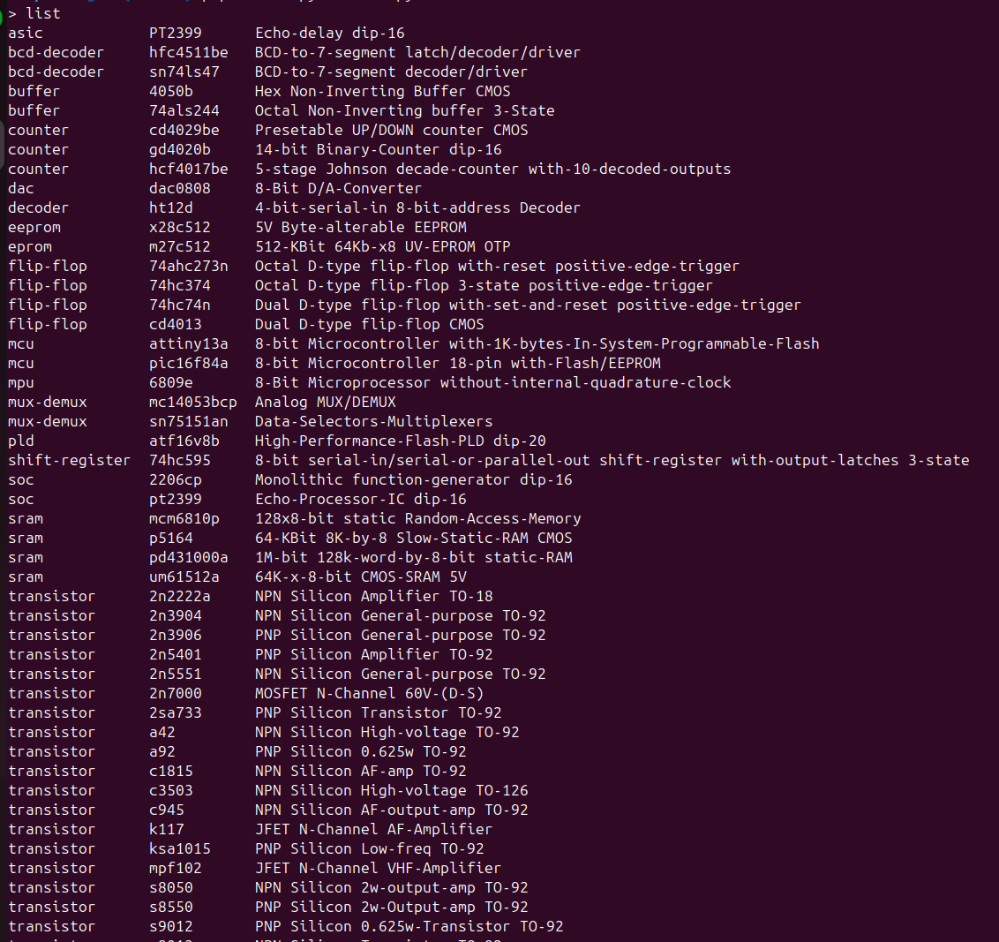
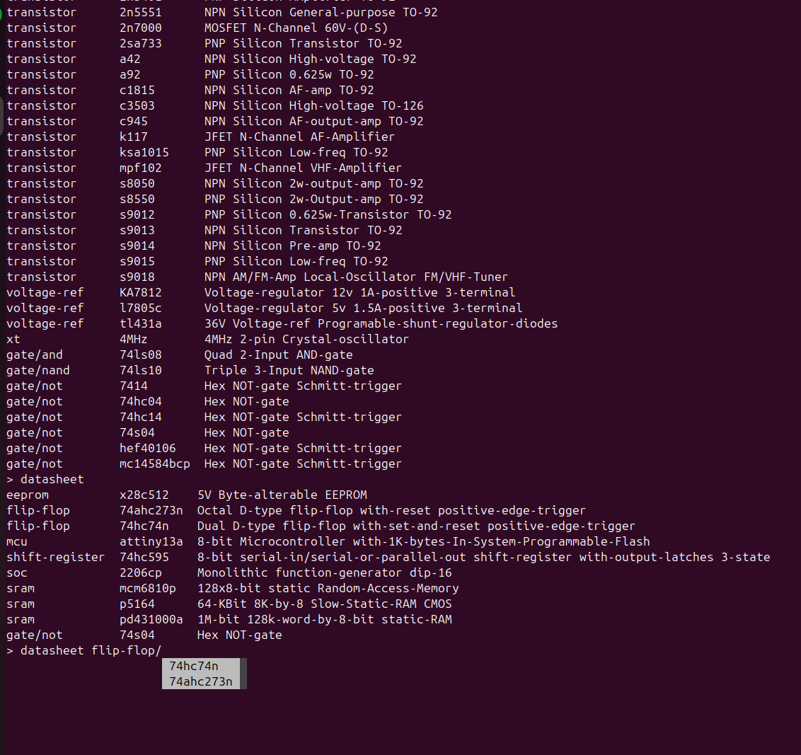

# PARTS
CLI electronic parts inventory





## Usage

```
list [<category>/<child>/...]
ll   [<category>/<child>/...]
```
List parts. With no arguments, lists all parts. With a category path, filters to parts under that category. With a full path ending in a part identifier, shows that part's details.

```
add <category>/<child>/.../<identifier> [<description>]
add <identifier>
```
Add a part. A full category path creates nested categories as needed. When called without arguments, prompts interactively for category, identifier, description, and quantity.

```
del <identifier>
del <category>/<child>/.../<identifier>
```
Delete a part or empty category. Prompts for confirmation before deleting. Categories with parts or children require an additional confirmation.

```
<part> +n
<part> -n
<part> n
```
Update a part's quantity. `+n` increments, `-n` decrements, a bare number sets the quantity. The part can be an identifier or a category-qualified path.

```
datasheet [<part>]
```
Open a part's datasheet URL in the system browser. With no arguments, lists all parts that have datasheets.

```
help
```
Show in-app help.

```
exit | quit | q
```
Exit the program.
